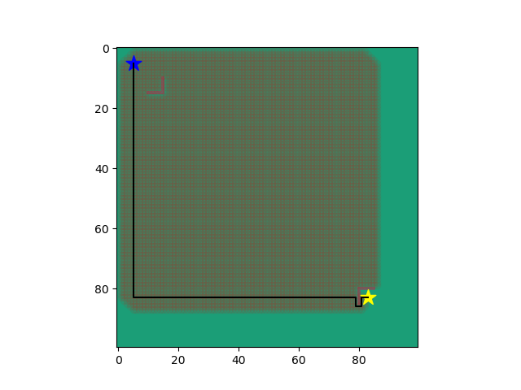

# A* Algorithm

Use the A* algorithm to find the optimal path from start to goal in a graph with obstacles. The generation of the graph is accomplished in C++ using configuration variables in `config.json` and `std::vector` of vector with type pointer to a `Node` object. 

All node costs are intiialized to infinity except for the first node. A prioritized queue is created to loop through nearby nodes, evaluating the accumulated cost of neighbor nodes for the minimum, labeling the best as parent, then inserting the unvisited neighbor nodes into the queue sorted by a heuristic until the goal is found. The optimal path can be found by reverse order from the goal to start of the nodes labeled as parent.

After running the algorithm, you can plot the grid and the optimal path using Pyhon.




# Usage

Generate the map and run the A* algorithm. Use vscode or 
```cmd
g++ -std=c++17 main.cpp node.cpp -o main
./main
```

Plot the optimal path on the grid.
```cmd
python plot_path.py
```

# Dependencies and Acknowledgements

Using `json.hpp` for reading from `config.json` and some writing of the grid to json.

[nlohmann/json](https://github.com/nlohmann/json)
