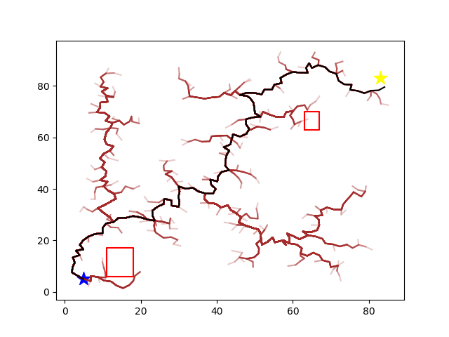

# Rapidly Exploring Random Trees (RRT)

Use the RRT sampling based algorithm to find a path from start to goal in a graph with obstacles. The generation of the graph is accomplished in C++ using configuration variables in `config.json`. There is no graph at the time of running this algorithm, so Nodes are structs and are discovered as the algorithm progresses.

There are additional hyperparameters such as `max_iterations`, `max_distance`, and `goal_threshold`. The path found by this algorithm is not optimal and is also not guaranteed to find a solution within the alotted iterations.

After running the algorithm, you can plot the grid and the discovered path using Pyhon.




# Usage

Generate the map and run the A* algorithm. Use vscode or 
```cmd
g++ -std=c++17 main.cpp -o main
./main
```

Plot the optimal path on the grid.
```cmd
python plot_path.py
```

# Dependencies and Acknowledgements

Using `json.hpp` for reading from `config.json` and some writing of the grid to json.

[nlohmann/json](https://github.com/nlohmann/json)
